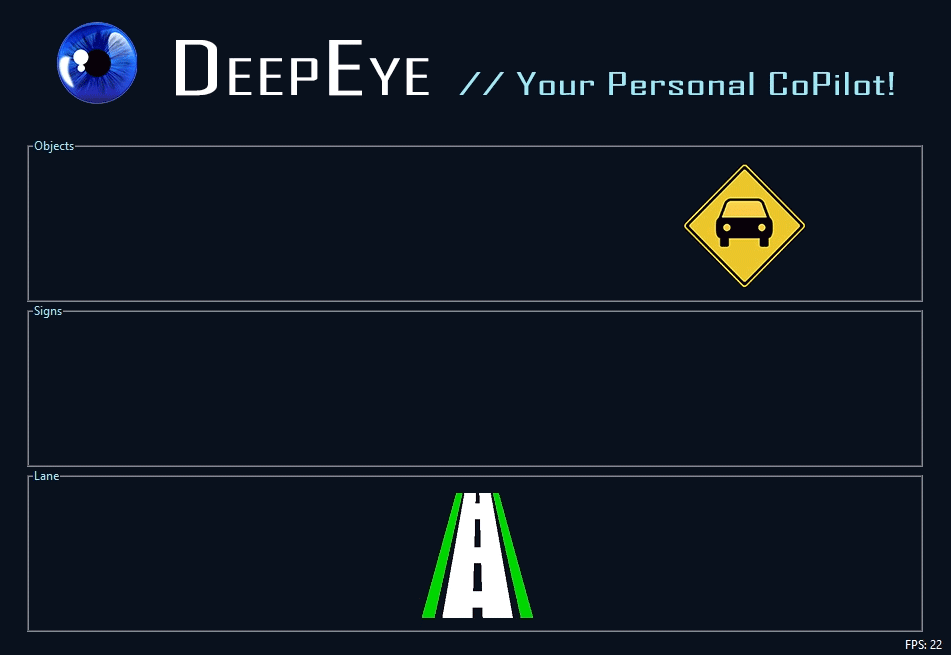

# DeepEye
This research project introduces a new Advanced Driver-Assistance Systems (ADAS) called *DeepEye*. **DeepEye** is a computer vision-based copilot system powered by conventional neural networks to preform real-time scene recognition. The system uses both Tensorflow and OpenCV to classify relevant objects surrounding a driving agent, and to estimate whether the driver is staying in lane or not, then alert the driver if any of objects/situations may pose a potential threat through a custom-designed dashboard (warning interface). We gratefully acknowledge the support of NVIDIA Corporation with the donation of the Titan Xp GPU used for this research.

DeepEye DashCam | DeepEye DashBoard 
:-------------------------:|:-------------------------:
 |  
