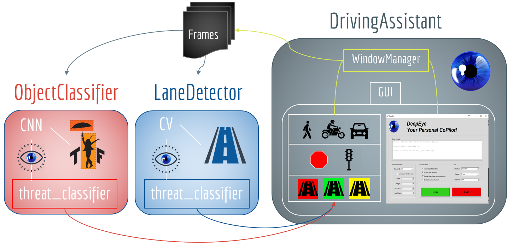

# DeepEye

## Table of Contents
1. [Introduction](#introduction)
2. [Architecture](#architecture)
3. [Requirements](#requirements)
2. [Running](#running)

## Introduction
Our system works in a cycle. Our master class where the cycle starts is the **DrivingAssistant**, containing the main interface.  The main interface controls the **WindowManger**, which captures frames from a given monitor and send them to the **ObjectClassifier** and **LaneDetector**. It also contains the *warnings* interface, which issues the driver warnings through visual cues on the dashboard. 

## Architecture

Name | Description 
--- | ---
**driving_assistant** | This is the main class that controls all advanced driver-assistance systems. For more information please refer to [DrivingAssistant](driving_assistant/README.md).
**object_classifier** | This class is a deep convolutional neural network implemented using Tensorflow Object Detection API. For more information please refer to [ObjectClassifier](object_classifier/README.md).
**lane_detector** | This class detects current lane that the car is driving in, then highlights both the road markers, as well as, the area enclosed by your lane onto the given frame using computer vision techniques. For more information please refer to [LaneDetector](lane_detector/README.md).

## Requirements
### Software
- Python 3.6+
- numpy 1.13.3+
- OpenCV 3+
- TensorFlow 1.4.0 (GPU).
- CUDA® Toolkit 9.0.
- cuDNN v6.0.
- mss 3.1+
- pickle 11.1+

### Hardware
- Nvidia Titan Xp GPU (or better)
- 12+ GB RAM 

## Running
Run `main.py` using **Python 3** in your terminal to launch the program.