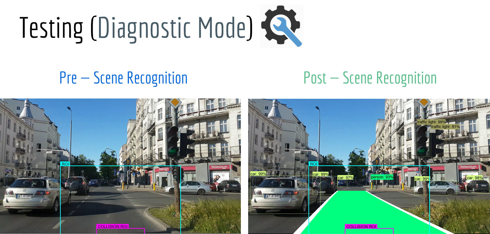
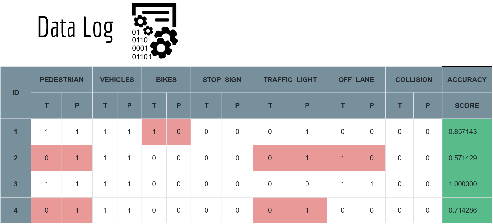

# DeepEye: DrivingAssistant

## Table of Contents
1. [Introduction](#introduction)
2. [Window Management](#window-management)
3. [Diagnostic Mode](#diagnostic-mode)
4. [Methods](#methods)

## Introduction
Our system consists of two major layers. In the first layer, a deep convolutional neural network mainly used for object detection and image classification. The network takes in a raw pixel image, then classify it into one of the labels defined in the dataset. The output of the CNN will then be fed into the second layer, which is going to perform online motion analysis and trajectory-based tracking to detect any situations that may pose a potential threat to the driving agent. Lastly, the result of our structure for motion (SfM) system will then be transformed to voice warning system that would notify the driver of any upcoming threats.

## Window Management
We use a cross-platform API for captureing screenshots called (Python MSS). For more information about MSS-API refer to [python-mss](http://python-mss.readthedocs.io/examples.html).

**Note:** By default our calss will capture the entire main monitor and pass it into the CNN.
Here's a list of additional parameters to look at:

Parameter | Description 
--- | ---
**monitor_id** | ID of the monitor to be captured.
**window_top_offset** | Top Offset in pixels **(0 by default)**.
**window_left_offset** | Left Offset in pixels **(0 by default)**.
**window_width** | The desired width of the captured window **(full width of the given monitor by default)**.
**window_height** | The desired height of the captured window **(full height of the given monitor by default)**.
**window_scale** | A scaling factor for the captured window **(1.0 by default)**.

## Diagnostic Mode
When you run the system in diagnostic mode, the system will take 10-15 screenshots every minute (varies based on the frame rate). Each screenshot demonstrates a given frame captured by our system prior to our sense analysis and after our detection and classification like the following:

Then, we made a dataframe that stores the ID of the captured frame along with a set of attributes that were detected in the given frame. Each screenshot will be associated with a data entry that gets generated automatically to describe the given frame, and will eventually saved to a CSV file with a timestamp to indicated when it was done.

The results of our system will then get compared to another log created by a human tester. Finally, each data entry in our log files will get an “accuracy” score based on the true/false positive predictions, then we calculate an average score to express how well the system is doing. For more information please refer to [TEST](../test/README.md).

## Methods
Name | Description 
--- | ---
**user_interface** | This is a graphical user interface built using Python TkInter. For more information  please refer to [GUI](user_interface/README.md).
**run()** | Capture frames, initiate both objects and lane detectors, and then visualize output.
