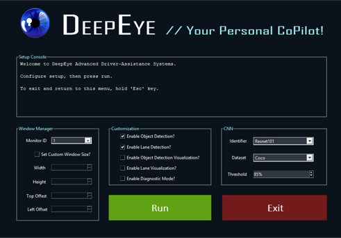
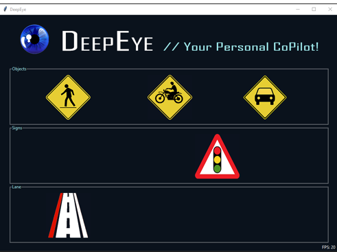

# DeepEye: UserInterface

## Table of Contents
1. [Introduction](#introduction)
2. [Methods](#methods)
3. [Customization](#customization)

User Interface          |  Warning Interface
:-------------------------:|:-------------------------:
  |  

## Introduction
This is a Graphical User Interface that pops up as soon as main is run.  This allows the user to change certain useful parameters for running the program, detailed below.  Once the user clicks "Run", the program launches with the given parameters.
The code makes use of the Tkinter library.  The boilerplate code (for widget creation and placement) was generated using [Page](http://page.sourceforge.net/), a drag-and-drop Python GUI creation tool.

## Methods
Name | Description 
--- | ---
**Window** | This is the main class that contains all the widgets and their associated variables, positioning and default values.
**show_label** | This is used to raise the positioning of one widget above another.
**hide_label** | Similarly, this is used to lower the positioning of one widget below another.
**updateState** | This updates the warning icons and FPS counter on the interface while the main program is running.  It accesses the threats dictionary, and will either call show_label or hide_label for each warning icon widget.
**playBeep** | Plays a beep sound effect.  Is called in the updateState method when a collision threat is detected.
**FlipState** | This method controls whether the custom window width and height widgets are enabled or disabled based on the state of the checkbox above them.
**set_adas_prams** | This sets up all of the different parameters for the Driving Assistant.  The paramters are obtained from the setup widgets.  Some are converted to appropriate data types (strings to ints, for example).
**mainLoop** | This in how the main program functions.  It calls the [DrivingAssistant](../README.md) class to start the program, then enters a loop which runs untils the escape key is pressed.  In the loop, the run method in driving_assistant is called, and then the updateState method is called.  The frame rate is also updated.  When the loop exits, it goes back to the setup frame.
**runProgram** | Simply calls the mainLoop method, but in a new thread.
**exitProgam** | Destroys all the windows.  Is called when the Exit button is pressed.
**TextRedirector** | This class is used to redirect system output to the textbox in the setup interface.
**AutoScroll** | Autogenerated code from [Page](http://page.sourceforge.net/) which creates an autoscrolling textbox.  This is used for the command line output in the setup frame.    
 
## Customization
Name | Description 
--- | ---
**Monitor ID** | This selects which monitor to feed frames.  The default values are 0, 1 , and 2.  For the typical dual-monitor setup, 0 is both, whereas 1 and 2 are the other individual monitors.  Eventually this will hopefully be populated only by options available to the user.
**Custom Window Size** | If the Set Custom Window Size button is not checked, then the frame size will default to the size of the entire monitor that's feeding the visual stream.  If it's checked, this allows the user to enter a custom size (a smaller window size results in better performance).
**Top/Left Offset** | By default, the visual stream will be feeding from the very top left corner on the monitor, even with a custom smaller window size.  Adding an offset allows the user to change what part of the screen is being fed to the visual feed.
**Enable Object Detection** | Toggles whether to run object detection.
**Enable Lane Detection** | Toggles whether lane detection runs.  Will significantly decrease FPS.
**Enable Object  Visualization** | Toggles whether to visualize objects.  Will decrease FPS.
**Enable Lane Visualization** | Toggles whether to visualize lanes. Will decrease FPS.
**Diagnostic Mode** | Toggles whether to run in diagnostic mode.  Every time the run method is called, a frame is exported before and after the object/lane detection.  The values of the threats dictionary is added to a CSV which lists the threat dictionary results from each frame for testing purposes.
**CNN** | There are three options for changing the feature identifier model. The default is Resnet101, which gives us the best hardware performance.  NAS is a more accurate model, however its performance is slower.  Inception-Resnet is a compromise between the two, however we found that it didn't perform any better for us.
**Dataset** | There are two options: Coco and Kitti.  Coco is an American trained dataset, with more classes, so this is the default option.  Kitti has less classes, and was trained in Europe.
**Threshold** | This controls the confidence threshold cutoff for detected objects.  Any object detected with a confidence below the set threshold will not be displayed onscreen.  The default value is 85%.

*Note:* press the (ESC) key to return to the setup menu.