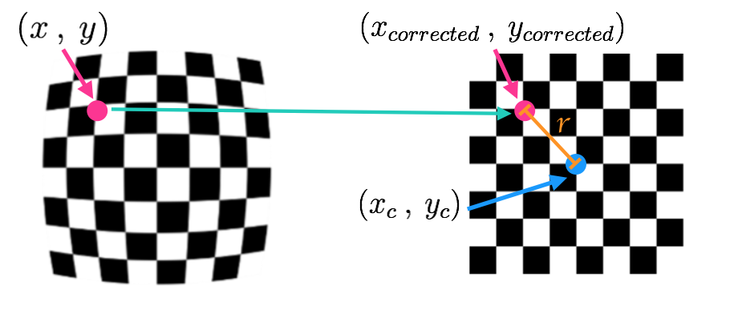
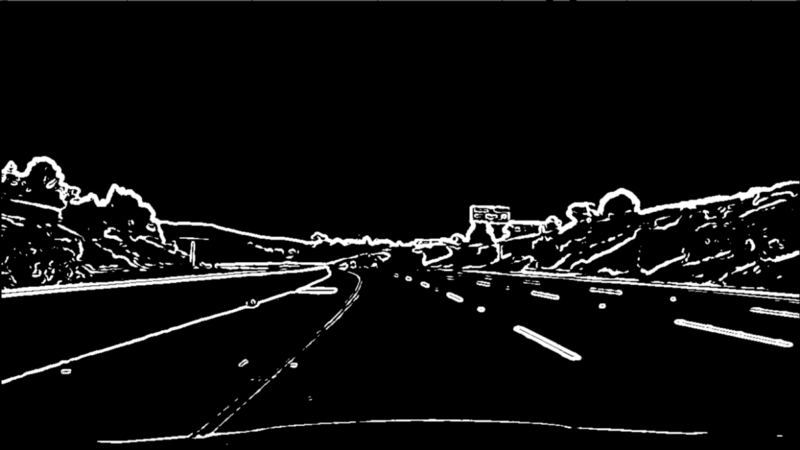
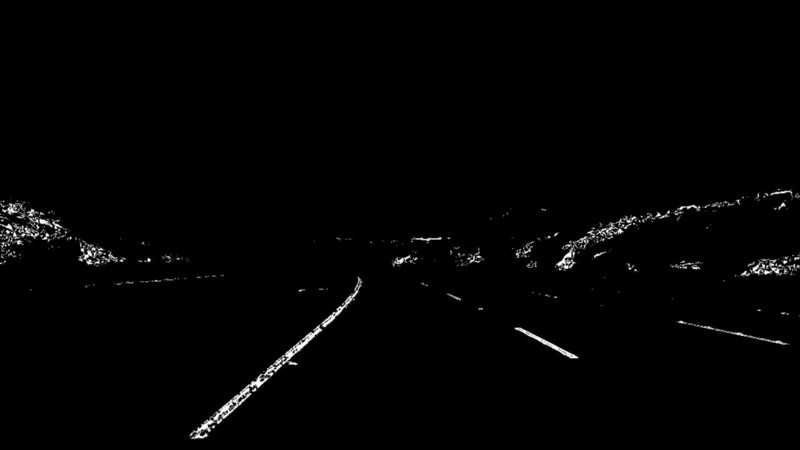
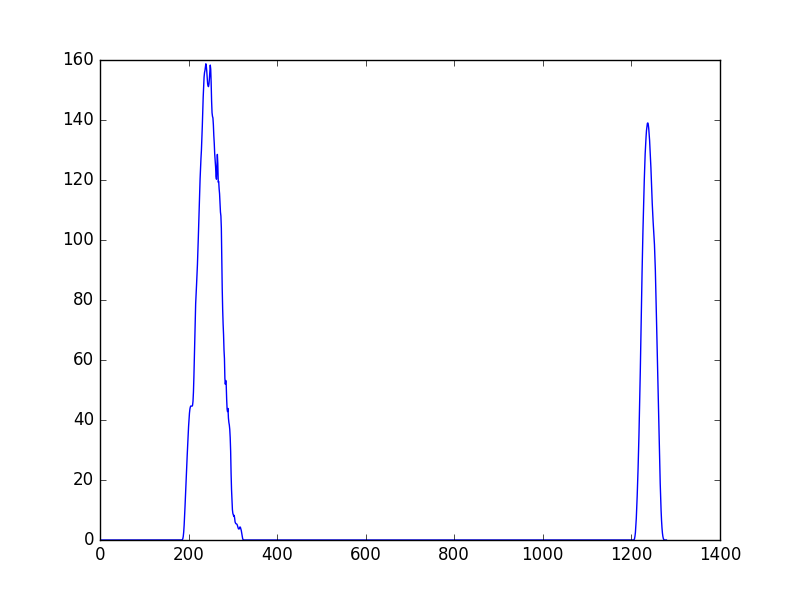
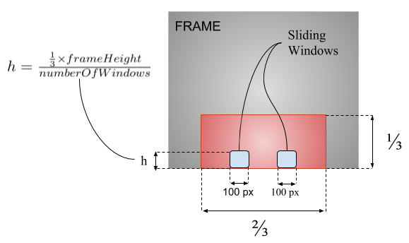

# DeepEye: LaneDetector

## Table of Contents
1. [Introduction](#introduction)
2. [Algorithms](#algorithms)
3. [Methods](#methods)
4. [Customization](#customization)
5. [Licensing Information](#licensing-information)

## Introduction
This class uses a lot of OpenCV built-in functions to detect the current lane that the car is driving in, then highlights both the road markers, as well as, the area enclosed by your lane onto the given frame.

## Algorithms

### Camera Calibration and Frame Undistortion
3D objects are normally transformed into 2D projections of the objects in a 2D-space, which causes various levels of distortion depending on the camera used to take the picture. There are ways to effectively undo this distortion using some functions provided in the OpenCV library (i.e. [cv2.findChessboardCorners](https://docs.opencv.org/3.3.1/d9/d0c/group__calib3d.html#ga93efa9b0aa890de240ca32b11253dd4a), [cv2.calibrateCamera](https://docs.opencv.org/3.3.1/d9/d0c/group__calib3d.html#ga687a1ab946686f0d85ae0363b5af1d7b), [cv2.undistort](https://docs.opencv.org/3.3.1/da/d54/group__imgproc__transform.html#ga69f2545a8b62a6b0fc2ee060dc30559d)). 

We start by preparing (object points), which will be the (x, y, z) coordinates of the chessboard corners in the original image. We then used the output `object_points` and `image_points` to compute the camera calibration and distortion coefficients using the `cv2.calibrateCamera()` function.  We applied this distortion correction to the test image [chessboards](object_classifier/lane_detector/camera_cal) using the `cv2.undistort()` function and obtained this result: 

### Color Thresholding
We used a combination of color and gradient thresholds to create a bitmap of zeros and ones that locates the exact pixels that we are interested in within the given frame. 

- [cv2.cvtColor | COLOR_BGR2HSV](https://docs.opencv.org/3.0.0/df/d9d/tutorial_py_colorspaces.html): to detect yellow road marks.

- [cv2.equalizeHist](https://docs.opencv.org/3.2.0/d5/daf/tutorial_py_histogram_equalization.html): to improve the contrast of the frame, and to detect white road marks.

- [cv2.Canny](https://docs.opencv.org/3.3.1/da/d22/tutorial_py_canny.html): for edge detection
    

- [cv2.GaussianBlur](https://docs.opencv.org/3.1.0/d4/d13/tutorial_py_filtering.html): removing gaussian noise from the frame.

- [cv2.morphologyEx](https://docs.opencv.org/3.0-beta/doc/py_tutorials/py_imgproc/py_morphological_ops/py_morphological_ops.html): a morphological transformation to paint/fill the small gaps in the detected lines, basically to get a (solid line) instead of an (intermittent or dashed line)

#### HSV Mask
First, we applied an HSV mask to the undistorted image, which helps to extract the yellow lines by focusing on the hue and saturation of the pixel and not so much on how dark te pixel might be.

#### Canny Edge Detection
It is a technique widely used in computer vision systems to essentially extract structural information from an image and reduce the amount of data that need to be be processed dramatically. We applied this operator only to the bottom half of the image assuming that our region of interest is only lower section of the input image where lane marks are expected to be, then we obtained this result: 

Canny          |  After removing gaussian noise
:-------------------------:|:-------------------------:
  |  

#### Perspective Transform
This step is a very basic step, yet very crucial to figure out the lane curvature. The idea is to map the pixels in a given image to different ones with a new perspective, particularly, a **bird’s-eye view** in order to view a lane from above [cv2.getPerspectiveTransform & cv.warpPerspective](https://docs.opencv.org/3.4.0/da/d6e/tutorial_py_geometric_transformations.html).

#### Lane Detection
For this step, we applied a smart **sliding window** technique to identify the exact pixels corresponding to the road marks. Starting from the very bottom of the image, we insert two windows, one for each peak point of the histogram of the bitmap. We then adjust the window's position based on the average density of pixels within the given window and slide the windows upwards till we reach the end of the image. Lastly, we draw a line through the center points of the windows to represent the lane boundary.

Bird's-eye view (bitmap) | Bitmap Histogram |  Bird's-eye view (lane detected)
:-------------------------:|:-------------------------:|:-------------------------:
 |  |  

Initially, the lane detector was hardcoded to accept a particular frame size, and then it would detect lane-pixels by focusing on the bottom-half of the frame to. Then, we updated our **LaneDetector** class to adopt various frame sizes. Furthermore, instead of the focusing on the bottom-haf of the frame, it captures a specific area within the lower half of the frame, particularly, one-third of the frame vertically, and two-thirds of the frame horizontally starting from the center as illustrated in the graph below:

 

## Methods
Name | Description 
--- | ---
**\_\_init\_\_** | The constructor doesn't necessarily require passing any parameters as they all have some satisfactory default values to start with. See [Customization](#customization) for detailed information. 
**detect_lane()** | Detect the current lane that the car is driving in.
**threat_classifier()** | Evaluate the current situation for any potential threats. 

## Customization
To use a different classifier and/or different dataset you'll need to look at:

Parameter | Description 
--- | ---
**marker_color** | A Tuple of RGB values to indicate the color used to mark the lane divider.   **(255, 255, 255)[White]** by default.
**lane_color** | A Tuple of RGB values to indicate the color used to mark the area enclosed by your lane.   **(0, 255, 127)** [Green] car is relatively in the center of lane.   **(255, 255, 127)** [Yellow] car is slightly off-lane.   **(255, 127, 127)** [Red] car is off-lane.

## Licensing Information
The following code was inspired by [Udacity: self-driving-car project](https://github.com/udacity/CarND-Advanced-Lane-Lines).

Original SourceCode was adopted from @ [advanced_lane_finding](https://github.com/ndrplz/self-driving-car) by Andrea Palazzi.
 
